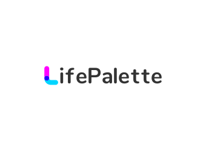

<p align="center">
  <br>
  
  <br>
  <br>
</p>

<!-- <h1 align="center">LifePalette</h1> -->
<p align="center">🐻Record your memories and craft your own masterpiece of life</p>

<!-- **English** | [中文](./README.zh-CN.md) -->

- [Preview](https://lpalette.cn)

- [Preview2](https://lifepalette-web.netlify.app)

## 🚀 Origin

- 🎈 Record your memories and craft your own masterpiece of life

## 🦄 Function

- ⚡ **QR Login**: Use nestjs as backend, and integrate QR login
- 🐱 **Ali oss file upload**: File upload based on `ali-oss` [Node.js](https://help.aliyun.com/document_detail/32067.html?spm=a2c4g.32070.0.0.607a55afYXWVU3) implementation
- 🎈 **SMS verification**: Send and verify SMS through `Ali Da Yu`
- 🥏 **Dynamic release**: Release pictures, text and videos

- 🚩 **Personal information modification**: To be developed...

- 📦 **livephoto**: Show live photos, [how to uploud livephoto](./public/docs/livePhoto/README.md)

## Features

- ⚡️ [Vue 3](https://github.com/vuejs/core), [Vite](https://github.com/vitejs/vite), [pnpm](https://pnpm.io/)

- 📦 [Components auto importing](./src/components)

- 🐻‍❄️ [livephoto](https://developer.apple.com/live-photos),[how to uploud livephoto](./public/docs/livePhoto/README.md)

- 🍍 [State Management via Pinia](https://pinia.vuejs.org/)

- 🎨 [UnoCSS](https://github.com/antfu/unocss) - the instant on-demand atomic CSS engine

- 😃 [Use icons from any icon sets with classes](https://github.com/antfu/unocss/tree/main/packages/preset-icons)

- 📥 [APIs auto importing](https://github.com/antfu/unplugin-auto-import) - use Composition API and others directly

- 🦾 [Api](./src/api) - a simple wrapper for [axios]

<!-- - 🎨 [Element Plus](https://element-plus.org/) - a Vue 3.0 UI library -->

- 🎨 [Element Plus](https://element-plus.org/) - a Vue 3.0 UI library
<!-- - 🚀  自动版本更新并生成 `CHANGELOG` -->
- 🚀 auto version update and generate `CHANGELOG`
<!-- - 🌈  自动版本更新并生成 `CHANGELOG` -->

<br>

## Motivation

Why do this **template**?

1. Save time wasted on configuration for the next development
2. Combine mainstream plug-ins to integrate modern development architecture and improve development efficiency

<br />

<!-- ## 启发 🐃

该模板受 **[vitesse](https://github.com/antfu/vitesse)** 启发，如果你有 `SSG`
的场景，推荐你使用 **[vitesse](https://github.com/antfu/vitesse)**。 -->

## Inspiration

This template is inspired by **[cloud-template](https://github.com/IceyWu/cloud-template)**

<br />

## Usage

### Development

Just run and visit http://localhost:9527

```bash
pnpm dev
```

### Build

To build the App, run

```bash
pnpm build
```

And you will see the generated file in `dist` that ready to be served.
