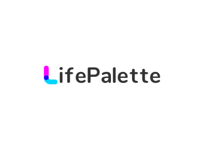

   
  
   
   

<!-- <h1 align="center">LifePalette</h1> -->

🐻记录生活，创造自己的生命调色板

**中文** | [English](./README.md)

- [预览](https://)

## 🚀 Origin

- 🎈 记录自己的生活点滴

## 🦄 功能

- ⚡ **扫码登录**: 后台使用 nestjs,接入扫码登录
- 🐱 **阿里 oss 文件上传**: 基于`ali-oss`的 [Node.js](https://help.aliyun.com/document_detail/32067.html?spm=a2c4g.32070.0.0.607a55afYXWVU3)实现文件上传
- 🎈 **短信验证**: 通过`阿里大于`实现短信发送以及验证功能
- 🥏 **动态发布**: 发布图文视频
  -🚩 **个人信息修改**: 待开发...
  

  ## 特性

- ⚡️ [Vue 3](https://github.com/vuejs/core), [Vite](https://github.com/vitejs/vite), [pnpm](https://pnpm.io/)

- 📦 [Components auto importing](./src/components)

- 🍍 [State Management via Pinia](https://pinia.vuejs.org/)

- 🎨 [UnoCSS](https://github.com/antfu/unocss) - the instant on-demand atomic CSS engine

- 😃 [Use icons from any icon sets with classes](https://github.com/antfu/unocss/tree/main/packages/preset-icons)

- 📥 [APIs auto importing](https://github.com/antfu/unplugin-auto-import) - use Composition API and others directly

- 🦾 [Api](./src/api) - a simple wrapper for [axios]

- 🎨 [Element Plus](https://element-plus.org/) - a Vue 3.0 UI library

 
