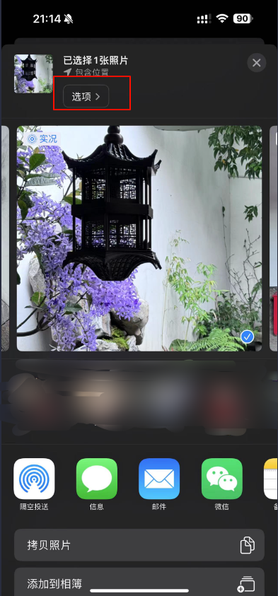
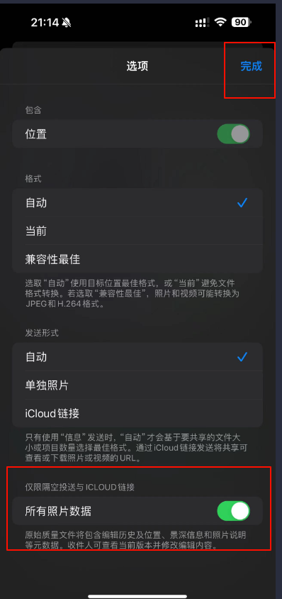
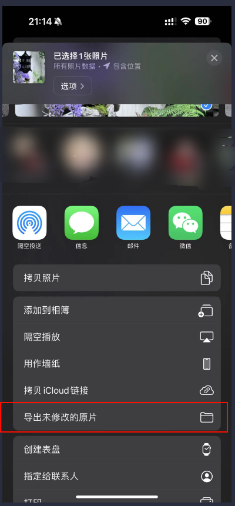
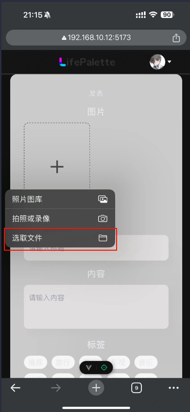
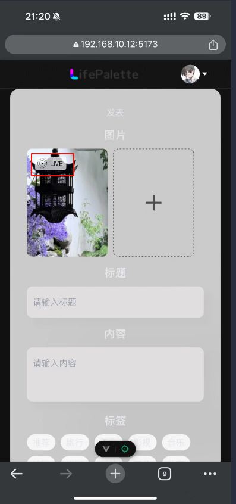

# LifePalette iphone实况图片上传教程

- 🎈 LifePalette支持实况图片上传，实况图片上传后，在web端和移动端都可以预览，方便用户分享和展示实况图片。

- web端通过Icloud进行相册访问下载，下载的压缩包有同样的MOV与HEIC两个文件，之后步骤同步骤5-7

## 步骤1

- 🎈 进入相册选择要上传的图片

  
 
  

## 步骤2

- 🎈 点击选项按钮

  
 
  

## 步骤3

- 🎈 打开所有照片数据

  
 
  

## 步骤4

- 🎈 点击导出未修改的原片

  
 
  

## 步骤5

- 🎈 在点击上传区域，选择“选取文件”

  
 
  

## 步骤6

- 🎈 选择MOV与HEIC两个文件（支持多张）

  
 
  

## 步骤7

- 🎈 上传成功在左上角显示会显示“live”，移动端长按图片可以预览，web端悬浮到live上可以预览

  
 
  

